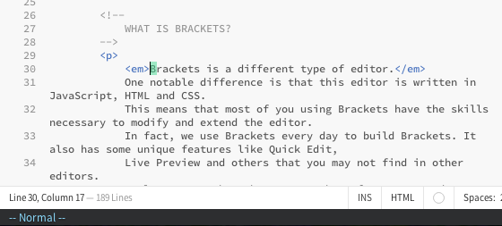

# Vimderbar
(a play on the German word _wunderbar_) is an extension meant to bring vim-like functionality to [Brackets](http://brackets.io).

All of the Vim keymapping is from [CodeMirror](http://codemirror.net)'s `keymap/vim.js`.

## Installing Vimderbar
0. In the Brackets menu bar, choose **File > Extension Manager...** (or click on the "brick" icon in the sidebar to the right).
0. Click the **Available** tab and search for **Vimderbar**. Click **Install**.
0. Enable Vimderbar via the Brackets menu with **View > Enable Vimderbar**.

## Configuration

### Keybindings
+ Add custom keybindings in Brackets preferences with `vimderbar.extraKeys = keyMap` (http://codemirror.net/doc/manual.html#keymaps)
  + Function based bindings are not supported, as the preferences are in json.

### Command Mode History
+ Default history is per-project, enable common history in Brackets preferences with `vimderbar.commonHistory = true`

## Features
+ `:vs`, `:sp` and `:on` hook Brackets split screen functionality.
+ Basic vim keybindings (`hjkl`, `yy`, `dd`, `p`, `P`, `o`, `O`, `gg`, `G`, etc).
+ Very basic `:` commands. `:w` saves, `:q` closes the document or the inline editor in focus, and `:e` opens the "Navigate > Quick Open" menu.
+ `:bp` and `:bn` implemented for open files, but Document order is different than what is shown in Working Files (uses)
+ Inline editor support, `Esc` closes inline editor when in Normal mode.
+ Use `:clearHistory` to reset current history.

## Limitations
+ Command Mode doesn't support chained commands (no `:wq`).
+ Can't perform complex commands (like `:1,8d`).

## License
See [LICENSE.txt](LICENSE.txt)

## Changelog

### 0.8.1
+ fix macro functionality, openDialog now handles entering macro mode (Issue #38)

### 0.8.0
+ fix esc key handling code to work with Brackets 1.2 preview (Issue #36)
+ reorganize modules and file tree
+ refactor event handling and initialization
+ fix deprecated event syntax

### 0.7.2
+ removed some bad console output
+ cleanup README

### 0.7.1
+ changed Vimderbar enable command to 'view.enableVimderbar'
+ cleaned up enable/disable logic and editor switching logic
+ added css to override CodeMirror default colors

## Contributing
Please do, by all means, hack on this extension and send me PRs. For coding conventions, review the [Brackets Coding Conventions](https://github.com/adobe/brackets/wiki/Brackets%20Coding%20Conventions).

Thanks!
